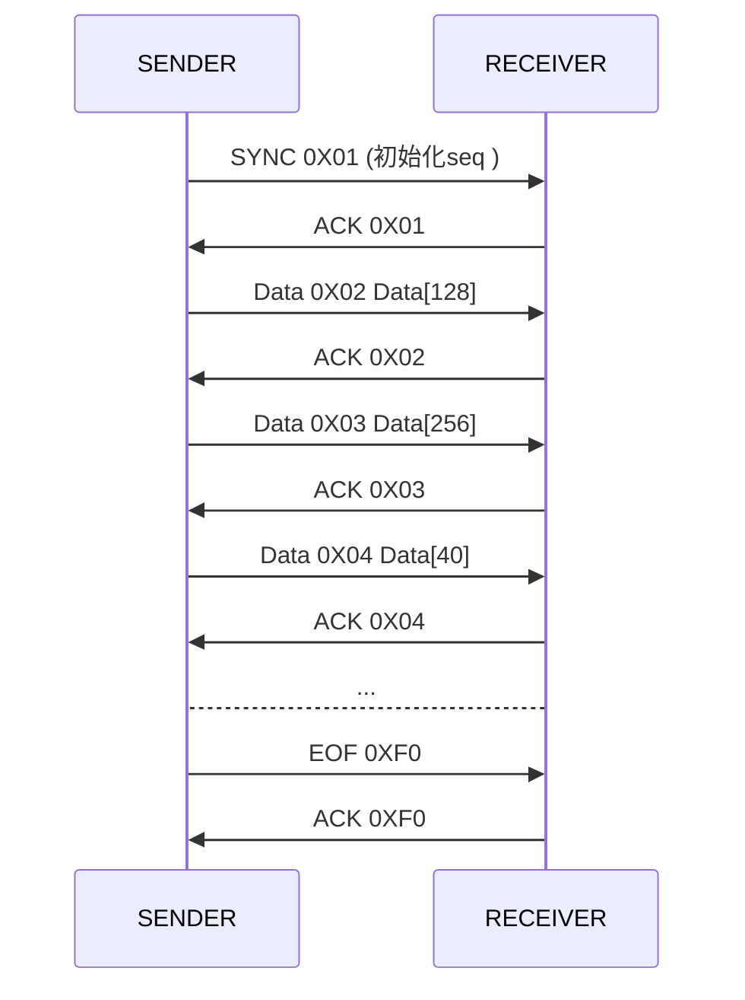

<center> 并口数据采集通讯协议</center>
<!-- toc orderedList:0 depthFrom:1 depthTo:6 -->

* [第一节 链路数据包结构（Base Package）](#第一节-链路数据包结构base-package)
  * [Base Package结构](#base-package结构)
* [第二节 数据采集设备传输数据和协议（TYPE=0x01）](#第二节-数据采集设备传输数据和协议type0x01)
  * [数据定义](#数据定义)
    * [Package基本结构：](#package基本结构)
      * [TYPE = SYNC | EOF](#type-sync-eof)
      * [TYPE = DATA](#type-data)
      * [TYPE = ACK](#type-ack)
      * [SYNC包：](#sync包)
      * [EOF 包：](#eof-包)
      * [DATA包：](#data包)
    * [交互示例](#交互示例)
    * [超时处理：](#超时处理)
    * [SEQ字段：](#seq字段)
* [CRC16 使用CRC16-CCITT查表法：](#crc16-使用crc16-ccitt查表法)

<!-- tocstop -->

@import "BaseProtocol.md"
# 第二节 数据采集设备传输数据和协议（TYPE=0x01）
- 本节定义数据采集设备和盒子的数据模型以及传输协议
- 本节定义的传输协议运行在第一节（UART Package）之上
- 本节定义的Package在第一节（UART Package）中的TYPE类型为0x01
## 数据定义
数据定义：
```
  SYNC：=0x01
  DATA:= 0x02
  ACK := 0x03
  EOF := 0x04  
  RESULT := 0x00 | 0x0F （0x00 ok， 0x0F fail ）
  VER := 0x01
```
### Package基本结构：
```
------------------------------------------
| TYPE VERSION (1) | SEQ (1 BYTE) | DATA |
------------------------------------------
```
- TYPE：四个bit，数据类型，取值SYNC | DATA| EOF| ACK
- VERSION：四个bit，版本号，当前版本号0x01
- SEQ：一个字节，用于判别包一致性
- DATA：传输给对方的数据，根据TYPE 不同取值不同
#### TYPE = SYNC | EOF
```
 -----------------------------------
 | TYPE VERSION (1) | SEQ (1 BYTE) |
 -----------------------------------
 TYPE :=SYNC | EOF
 VERSION := VER
```
#### TYPE = DATA
```
------------------------------------------
| TYPE VERSION (1) | SEQ (1 BYTE) | DATA |
------------------------------------------
TYPE :=DATA
VERSION := ver
DATA  := OCTET
```  
#### TYPE = ACK
```
------------------------------------------
| TYPE VERSION (1) | SEQ (1 BYTE) | DATA |
------------------------------------------
TYPE :=ACK  
VERSION := VER
DATA  := RESULT
```  

#### SYNC包：
	用于初始化一次会话, 同步双方seq 需要对方ACK包响应，且SEQ相同

#### EOF 包：
	用于结束一次会话,  需要对方ACK包响应，且SEQ相同
#### DATA包：
	用于会话中传输数据，SEQ递增 需要对方ACK包响应，且SEQ相同


### 交互示例


### 超时处理：
 - 发送端
 ```
	当发送端，接收到ACK fail，或者 在20ms内没有接收到ACK，选择重发一次， 如果重发再一次表示会话失败，结束会话
```
- 接收端
```
  如果在20ms 内没有数据，认为数据发送完毕，结束会话
```

### SEQ字段：
	SYNC 包初始化seq,  DATA 和 EOF 包采用循环递增方式产生该字段
@import "CRC16-CCITT.md"
